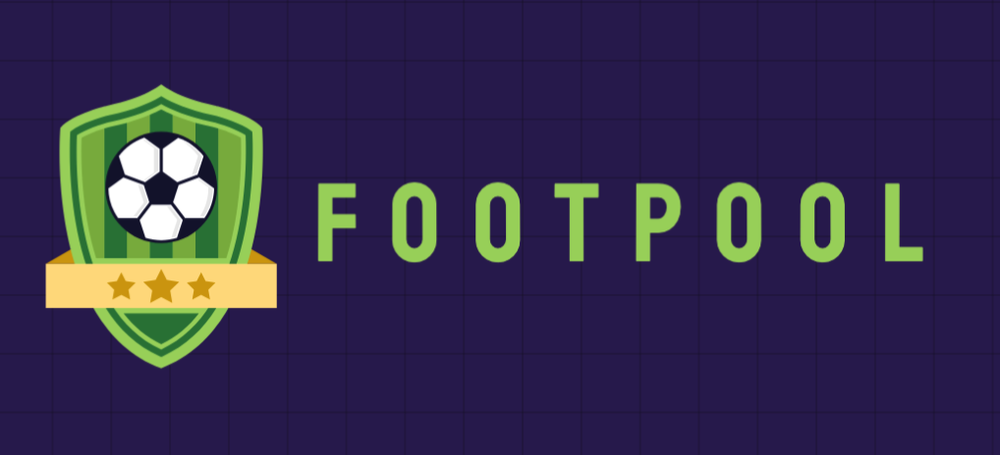

  <h4>
    <a href="https://www.footpool.xyz/">
      :link: Website
    </a>
     | 
    <a href="https://docs.footpool.xyz">
      :book: Documentation
    </a>
     | 
    <a href="https://twitter.com/footpool">
      Twitter
    </a>
  </h4>

### 👋Welcome to Footpool

FootPool is a groundbreaking decentralized betting application that revolutionizes the traditional sports betting experience by leveraging blockchain technology. 
Built on the Ethereum Virtual Machine (EVM) using Solidity, FootPool offers a secure, transparent, and fair platform where users can place bets on the outcomes of 
sports matches in the classic 1 X 2 format. The platform draws inspiration from the popular Spanish "quiniela," incorporating similar rules and betting structures to 
create a familiar and engaging user experience.
